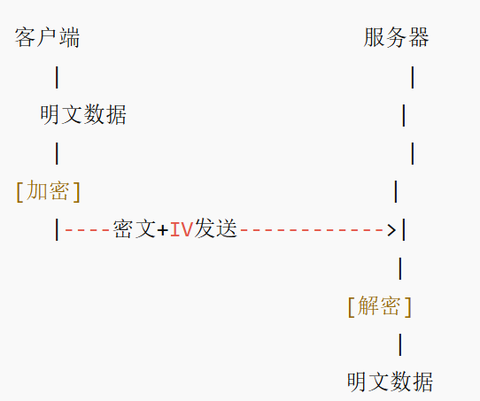

---
项目一
## 🧪 Algorithms Implemented

| Category         | Algorithm | Reversible | Key Length          | Security Level | Notes                         |
|------------------|-----------|------------|----------------------|----------------|-------------------------------|
| Symmetric Cipher | AES       | ✅         | 128/192/256 bits     | High           | Modern standard               |
| Symmetric Cipher | DES       | ✅         | 56 bits              | Weak           | Obsolete                      |
| Symmetric Cipher | 3DES      | ✅         | 112/168 bits         | Medium         | Transitional use              |
| Asymmetric Cipher| RSA       | ✅         | 1024–4096 bits       | High           | For key exchange & signatures|
| Hash Function    | MD5       | ❌         | -                    | Weak           | Vulnerable to collisions      |
| Hash Function    | SHA-256   | ❌         | -                    | High           | Recommended secure hash       |

---
# 非对称加密算法
## AES 加密解密流程

## AES CBC 模式关键概念说明
### 1. 初始化向量（IV）
- IV（Initialization Vector）用于保证相同的密钥和明文，每次加密产生不同的密文，防止信息泄露和密码分析。
- IV 必须是随机且唯一的，但不需要保密，可以与密文一起传输。
### 2. 填充机制（Padding）
- AES 加密要求明文长度是固定块大小（如16字节）的整数倍。
- 当明文长度不足时，需要进行填充，使其满足块大小的要求。
- 本项目示例采用的是 **PKCS#7 填充**，其原理是用填充长度的字节值重复填充数据块。
- 注意：填充的是明文数据，而非密钥。密钥长度固定为16、24或32字节。
### 3. Base64 编码
- 加密产生的密文和 IV 是二进制数据，直接存储或传输可能导致乱码或不兼容。
- Base64 编码可以将二进制数据转换为 ASCII 字符串，方便网络传输和文本存储。
### 4. 字符串与编码
- 字符串是字符序列，必须先通过编码（通常为 UTF-8）转换为字节序列，才能进行加密操作。
- 解密后得到字节数据，再用相同编码转换回字符串。
- 确保编码一致且数据完整，才能正确还原原始字符串。
---
## ECB模式和CBC模式的区别

| 方面           | ECB（电子密码本）                     | CBC（密码分组链接）                           |
|----------------|----------------------------------|------------------------------------------|
| **加密方式**     | 每个数据块独立加密，直接对明文分块加密       | 每个明文块先与前一密文块异或，再加密，第一块用IV     |
| **安全性**      | 不安全，容易暴露明文结构（相同明文块密文相同） | 更安全，密文块依赖前一密文块，避免重复模式泄露          |
| **随机性**      | 无随机性，同样的明文块必得相同密文块          | 有随机性，使用随机IV确保第一次加密不同               |
| **并行能力**     | 支持并行加密和解密                      | 加密过程串行，解密支持并行                        |
| **应用场景**     | 只适合加密随机数据或数据量极小               | 适合多数实际应用，推荐使用                         |
| **实现复杂度**   | 简单                                | 复杂，需要管理IV和块链接                           |

## DES算法核心知识点详细讲解
---
### 1. 分组大小和密钥长度
- **分组大小：64位（8字节）**  
  DES将明文按64位分组，逐块进行加密。每块独立处理，使加密有块的结构。
- **密钥长度：56位有效密钥（64位密钥中8位用于奇偶校验）**  
  实际使用的密钥长度是56位，这限制了DES的安全强度，容易被暴力破解。
---
### 2. Feistel结构
- DES基于**16轮Feistel网络**设计  
- 明文块被分成左右两半（各32位），每轮执行以下操作：  
  1. 用轮函数`F`处理右半块与当前轮密钥  
  2. 将`F`函数输出与左半块做异或运算  
  3. 交换左右半块位置  
- 这种结构使加密和解密过程对称且高效。
---
### 3. 初始置换（IP）与逆置换（IP⁻¹）
- 加密开始时对64位明文进行**初始置换(IP)**，打乱位序，提高扩散效果。  
- 解密结束时，执行与初始置换逆向的**逆置换(IP⁻¹)**，还原加密前顺序。  
- IP和IP⁻¹是固定表映射，不涉及密钥。
---
### 4. 轮函数（F函数）
- 输入：32位数据和48位轮密钥  
- 过程：  
  1. **扩展置换**：32位数据扩展为48位  
  2. 与48位轮密钥做异或  
  3. 通过8个**S盒**压缩替代，输出32位数据  
  4. 通过**P盒置换**，重新排列位  
- 轮函数实现了复杂的非线性和扩散。
---
### 5. S盒（Substitution box）
- DES有8个S盒，每个S盒输入6位，输出4位。  
- S盒是DES安全的关键，提供非线性替代，抵抗线性密码分析。  
- 每个S盒内的映射是固定的查表形式。
---
### 6. P盒（Permutation box）
- 对S盒输出的32位数据进行固定置换，增强扩散性。  
- P盒重新排列数据位，保证加密后比特分布均匀。
---
### 7. 轮密钥生成
- 由主密钥经过以下步骤产生16个轮密钥（各48位）：  
  1. **置换选择1（PC-1）**：将64位密钥压缩为56位，去除奇偶校验位  
  2. **循环左移**：将56位密钥分成左右两半，按轮数循环移位  
  3. **置换选择2（PC-2）**：将56位压缩为48位，作为当前轮的密钥
---
### 8. 加密与解密对称
- 加密和解密过程结构相同，唯一区别是**轮密钥的使用顺序相反**：  
  - 加密时，轮密钥从第一轮到第十六轮  
  - 解密时，轮密钥反向使用，从第十六轮到第一轮  
- Feistel结构使得相同算法既能加密也能解密。
---
### 9. 安全性与攻击
- 56位密钥长度限制了安全性，暴力破解在现代计算能力下可行。  
- 存在多种密码分析攻击方式：  
  - **差分攻击**：分析输入差分与输出差分的关系，减少破解复杂度  
  - **线性攻击**：利用明文、密文间的线性关系推断密钥  
- 为增强安全性，发展出**3DES**，多次串联DES加密。
---
# 非对称加密算法

 RSA算法重要知识点详解
---
### 1. 公钥密码体系基础
- RSA属于非对称加密算法，使用一对密钥：  
  - **公钥（Public Key）**：公开，用于加密或验证签名  
  - **私钥（Private Key）**：保密，用于解密或签名生成  
- 公开密钥加密，保证消息机密性；私钥解密，保证只有拥有私钥者能读。
---
### 2. 数学基础
- 依赖于大整数的乘法与模运算难题  
- **质因数分解问题**：给定大合数，难以分解为两个质数因子  
- RSA密钥由两个大质数 p, q 生成，乘积 n = p × q 是公钥的一部分。 
- 利用欧拉函数 φ(n) = (p - 1) × (q - 1) 计算加密和解密指数。
---
### 3. 密钥生成过程
- 选择两个大质数 p, q（通常1024位及以上）  
- 计算 n = p × q 和欧拉函数 φ(n) = (p - 1)(q - 1)  
- 选取公钥指数 e，满足 1 < e < φ(n)，且与 φ(n) 互质（常用65537）  
- 计算私钥指数 d，使得 d × e ≡ 1 (mod φ(n))  
- 公钥为 (n, e)，私钥为 (n, d)
---
### 4. 加密与解密
- **加密**：密文 c = m^e mod n，其中 m 是明文（数值形式）  
- **解密**：明文 m = c^d mod n  
- 模运算保证只有正确私钥 d 可以恢复明文。
---
### 5. 填充方案
- 纯数学RSA不安全，容易被攻击  
- 需结合填充算法，如：  
  - **PKCS#1 v1.5**（较旧，存在攻击风险）  
  - **OAEP (Optimal Asymmetric Encryption Padding)**（现代推荐）  
- 填充防止明文规律暴露，增强安全。
---
### 6. 安全性
- RSA安全基于大整数分解难题  
- 目前2048位及以上密钥认为安全，1024位密钥已不推荐使用  
- 防止侧信道攻击（如时间攻击）需要在实现中注意细节  
- 依赖安全随机数生成器，防止密钥预测
---

